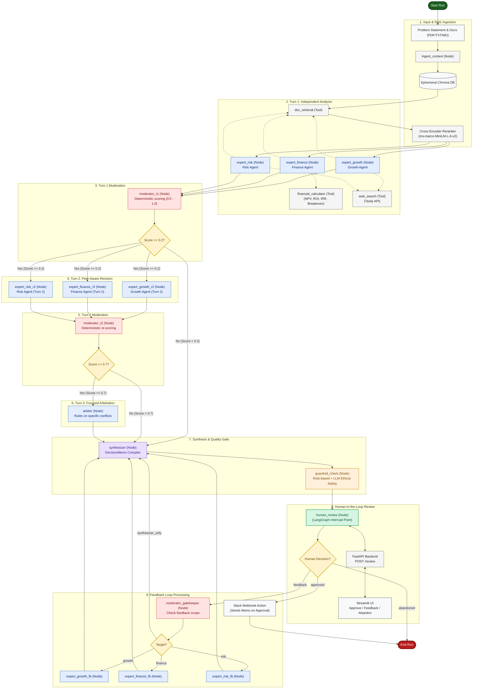

# Individual Contribution Report — Debate Colosseum
This document outlines the individual contributions, responsibilities, and specific implementations delivered by each of the four team members for the **Debate Colosseum** capstone project. The project was structured into four distinct development tracks (Tracks A, B, C, and D) to enable parallel execution and clean separation of concerns.
---
## Technical Architecture Overview
Debate Colosseum is a multi-agent business decision platform designed to ingest business problem statements, analyze them using domain-specific expert agents, measure disagreement, facilitate peer-aware revisions, arbitrate unresolved conflicts, and compile a structured executive decision memo. 
The division of labor was mapped as follows:
* **Track A:** Context Ingestion, Vector Indexing, and Shared Retrieval Tools
* **Track B:** Domain Expert Agents (Turn 1 and 2) and Quantitative Calculations
* **Track C:** Judgment Chain, Routing, Moderation, Arbitration, and Safety Guardrails
* **Track D:** FastAPI Backend, Checkpointing, Human-in-the-Loop Web UI, Observability, and Evaluation
---
## Track A: Ingestion & Shared Retrieval Tools
**Owner: Member A (Context & Search Engineer)**
Member A was responsible for the data ingestion pipeline and the shared tools that supply context to the expert agents. This track focused on document parsing, semantic search optimization, and web integration.
### Core Deliverables
* **Document Ingestion Pipeline (`src/rag/ingest.py`):**
  * Implemented text extraction for `.pdf`, `.txt`, and `.md` files. Integrated `PyPDF2` for handling multi-page PDF documents.
  * Configured `RecursiveCharacterTextSplitter` with a chunk size of 600 tokens and an overlap of 80 tokens.
  * Configured an ephemeral, in-memory Chroma vector store collection initialized per-run to ensure data privacy.
  * Authored the `ingest_context` LangGraph node to update the global `GraphState` with the initialized retriever.
* **Semantic Document Retrieval Tool (`src/tools/doc_retrieval.py`):**
  * Built a two-stage retrieval mechanism: retrieves the top 8 candidate chunks via cosine similarity, then reranks them to the top 4 using a local Cross-Encoder model (`cross-encoder/ms-marco-MiniLM-L-6-v2`).
  * Implemented a silent fallback mode: if a user submits a problem statement without uploading documents, the retriever evaluates to `None`, and the tool returns an empty list without throwing an exception.
* **External Web Search Tool (`src/tools/web_search.py`):**
  * Wrapped the Tavily search API to fetch external market data.
  * Configured rate-limit handling to catch HTTP 429 exceptions and retry once before returning a graceful error message.
  * Enforced schema compliance, formatting search results into a clean list of `{title, url, snippet}` structures.
### Files Touched or Created
* `src/rag/ingest.py` — Raw text extraction, chunking, and Chroma collection setup.
* `src/tools/doc_retrieval.py` — Retrieval tool with local cross-encoder reranking.
* `src/tools/web_search.py` — Tavily web search tool with retry mechanics.
* `src/tools/README.md` — Integration contracts and specifications for the other tracks.
* `tests/test_rag.py` — Tests for document chunking, indexing, and rerank accuracy.
* `tests/test_tools.py` — Unit tests for the Tavily integration.
* `tests/test_ingest_node.py` — Node-level tests verifying state mutations.
---
## Track B: Domain-Specific Expert Agents
**Owner: Member B (Agent Behavior & Calculations Engineer)**
Member B focused on agent persona design, system prompt engineering, quantitative tool integration, and enabling peer-aware agent interactions during Turn 2.
### Core Deliverables
* **Expert Agent Personas (`src/agents/`):**
  * **Growth Agent (`growth.py`):** Structured prompts targeting market expansion, competitive positioning, and customer acquisition.
  * **Finance Agent (`finance.py`):** Prompts focusing on unit economics, capital allocation, and budgeting. Integrated the financial calculator.
  * **Risk Agent (`risk.py`):** Prompts designed to identify operational, legal, reputational, and compliance risks. Formatted risks as a structured list of severity and likelihood ratings.
* **Agent Execution Wrapper (`src/agents/base_wrapper.py`):**
  * Created a unified wrapper utilizing LangChain's `with_structured_output` to enforce Pydantic schema validation.
  * Implemented an auto-retry loop: on schema validation failure, the wrapper makes a second call injecting the validation error as feedback to the model.
* **Deterministic Financial Calculator (`src/tools/financial_calc.py`):**
  * Built pure Python mathematical functions to compute Return on Investment (ROI), Net Present Value (NPV), Internal Rate of Return (IRR), and breakeven periods. This provided the Finance agent with precise mathematical grounding, avoiding LLM arithmetic errors.
* **Turn 2 Peer-Aware Revision Logic:**
  * Added conditional prompt injection for `turn == 2`.
  * Extracted peers' Turn 1 recommendations, confidence scores, and summaries, alongside the moderator's conflict report, injecting them into each agent's Turn 2 context.
  * Enforced the generation of explicit `dissent_notes` whenever an agent chose to maintain a stance that disagreed with its peers.
### Files Touched or Created
* `src/agents/growth.py` — Growth agent implementation and prompt configuration.
* `src/agents/finance.py` — Finance agent implementation and quantitative integration.
* `src/agents/risk.py` — Risk agent implementation and risk-profile formatting.
* `src/agents/base_wrapper.py` — Unified agent execution and schema validation wrapper.
* `src/tools/financial_calc.py` — Mathematical formulas for ROI, NPV, IRR, and breakeven.
* `tests/test_agents_t1.py` — Isolated testing of Turn 1 agent schemas.
* `tests/test_agents_t2.py` — Verification of Turn 2 peer injection and dissent logging.
---
## Track C: Judgment Chain & Safety Guardrails
**Owner: Member C (Orchestration & Moderation Engineer)**
Member C was responsible for designing the moderation, arbitration, synthesis, and safety mechanisms. This track focused on establishing the routing thresholds and compiling the final deliverables.
### Core Deliverables
* **Moderation and Disagreement Scorer (`src/agents/moderator.py`):**
  * Developed a deterministic scoring heuristic (0.0 to 1.0) evaluating:
    * Recommendation label mismatches (proceed, caution, do not proceed).
    * Normalized standard deviation of confidence scores.
    * Divergence in risk severity ratings.
  * Implemented an LLM-based call to summarize flagged conflicts into a `DisagreementReport`.
  * Established the routing thresholds: score < 0.2 routes to the Synthesizer; score $\ge$ 0.2 routes to Turn 2; score $\ge$ 0.7 after Turn 2 routes to the Arbiter.
* **Impartial Arbiter Agent (`src/agents/arbiter.py`):**
  * Engineered an Arbiter persona that rules specifically on the conflicts listed in the `DisagreementReport`. The Arbiter is constrained to ruling on existing arguments rather than running a new debate.
* **Synthesizer Agent (`src/agents/synthesiser.py`):**
  * Designed the prompt that compiles final analyses, dissent, and arbitration rulings into a unified `DecisionMemo`.
  * Coded the human feedback routing: parses incoming human feedback to check if it can be resolved by the Synthesizer alone, or if it requires target agent revision.
* **Dual-Stage Guardrail System (`src/guardrails/checks.py`):**
  * **Stage 1 (Deterministic):** Validates memo structure, ensuring the risk register and next steps are not empty, and that the summary meets minimum length requirements.
  * **Stage 2 (LLM-based):** Executes an ethical and policy safety check to block recommendations involving illegal, discriminatory, or high-risk activities.
### Files Touched or Created
* `src/agents/moderator.py` — Disagreement calculation and routing logic.
* `src/agents/arbiter.py` — Targeted conflict arbitration node.
* `src/agents/synthesiser.py` — Decision memo compiler and feedback router.
* `src/guardrails/checks.py` — Deterministic and LLM-based safety checks.
* `tests/test_moderator.py` — Tests verifying the mathematical bounds of the scorer.
* `tests/test_synthesizer.py` — Verification of dissent preservation in the final memo.
* `tests/test_guardrails.py` — Safety test cases (passing, blocking, and incomplete states).
---
## Track D: Full Graph Assembly, API, UI & Eval
**Owner: Member D (Integration & Interface Engineer)**
Member D served as the systems integrator. Responsibilities included assembling the final LangGraph workflow, managing API endpoints, implementing state persistence, building the user interface, and establishing the evaluation harness.
### Core Deliverables
* **LangGraph Workflow Assembly (`src/graph.py`):**
  * Assembled all agent and function nodes, defining the parallel fan-outs for Turn 1 and Turn 2, conditional routing edges, and the human review interrupt point.
* **FastAPI Backend Services (`src/api/main.py`):**
  * Built the async REST API hosting `/runs` (submission with file uploads), `/runs/{id}/status` (polling for state and timeline updates), and `/runs/{id}/review` (resuming the graph with human feedback).
  * Integrated LangGraph's `MemorySaver` checkpointer for session state persistence, enabling the graph to pause at the interrupt point and resume asynchronously.
* **Human-in-the-Loop Update Mechanics (`src/hitl/review.py`):**
  * Designed the pure-function `handle_review` to process human approvals, feedback logs, and manual memo edits, updating the global state safely.
* **Streamlit Frontend Dashboard (`frontend/app.py`):**
  * Designed a multi-step user interface including document uploading, an active debate timeline rendering stage-by-stage node execution statuses, and an executive memo viewer with styled risk indicators and expert position tabs.
  * Added interactive controls for approving, providing feedback, or abandoning runs.
* **Slack Action Executor:**
  * Configured an outgoing action that formats the approved `DecisionMemo` and POSTs it to a configured Slack incoming webhook.
* **Evaluation Harness (`tests/eval/run_eval.py`):**
  * Built an automated evaluation script containing 5 hardcoded test scenarios (representing EU market expansion, discount campaigns, competitor acquisitions, early-stage hiring, and prompt injection).
  * The harness executes the graph directly, records routing decisions, and logs results to the `logs/eval_results/` directory for regression testing.
### Files Touched or Created
* `src/graph.py` — Assembled LangGraph workflow and state transitions.
* `src/api/main.py` — FastAPI application and async background task runner.
* `src/hitl/review.py` — HITL state transition logic.
* `frontend/app.py` — Streamlit dashboard and user interface.
* `src/config.py` — Global settings and LangSmith tracing setups.
* `tests/eval/run_eval.py` — Multi-scenario offline evaluation harness.
* `tests/__init__.py`, `tests/eval/__init__.py` — Test package scaffolding.

